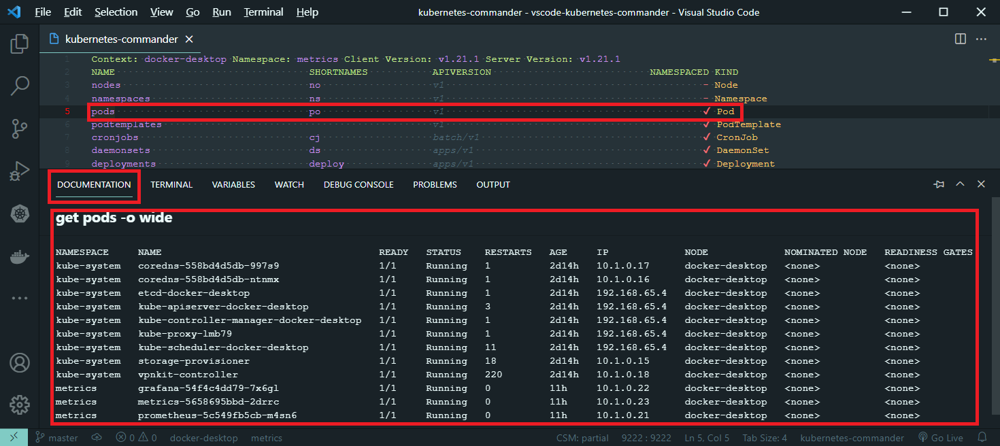

# vscode-kubernetes-commander

This is extention is now DEPRECATED. Please use [Kubernetes Commander - Kubernetes Commander view based on VSCode Webview](https://marketplace.visualstudio.com/items?itemName=sandipchitale.vscode-kubernetes-commander-ng)

Kubernetes commander
## How to use ?

In command palette type ```Kubernetes Commander: Show``` to show the Kubernetes Commander.



**Tip** This extension works great with [Docs View](https://marketplace.visualstudio.com/items?itemName=bierner.docs-view). The ```Documentation``` tab will show the hover text.

Hover shows the ```kubectl get -A resourceType``` output.
Hover shows the ```kubectl explain resourceType``` output when the cursor is on ```Kind``` column.
### Keybindings

|Keybinding|Command|
|---|---|
|```c```|Edit Kube Config|
|```d```|Describe specific resources|
|```shift+d```|Describe specific resources from All Namespaces|
|```ctrl+d```|Describe resources of type|
|```ctrl+alt+shift+d```|Describe resources of type from All Namespaces|
|```e```|Edit specific resources|
|```shift+e```|Edit specific resources from All Namespaces|
|```g```|Get specific resources|
|```shift+g```|Get specific resources from All Namespaces|
|```ctrl+g```|Get resources of type|
|```ctrl+alt+shift+g```|Get resources of type from All Namespaces|
|```h```|Documentation for resources of type|
|```l```|Log specific pod|
|```shift+l```|Log specific pod from All Namespaces|
|```n```|List Names of resources of type|
|```shift+n```|List Names of resources of type All Namespaces|
|```s```|Shell into specific pod or node. Uses ```nsenter``` images to shell into node.|
|```shift+s```|Shell into specific pod from All Namespaces|
|```t```|Tail log specific pod|
|```shift+t```|Tail log specific pod from All Namespaces|
|```F5```|Reload|
|```w```|Switch namespace|
|```x```|Explain Resource Type|
|```y```|Entropy on Node. Uses ```nsenter``` images to execute the command.|
|```CTRL+,```|Settings|
|```q```|Quit|
